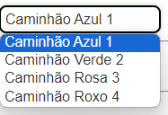
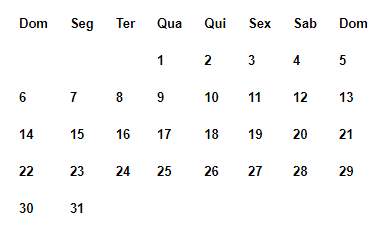
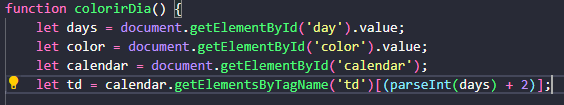
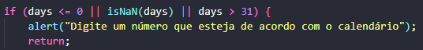
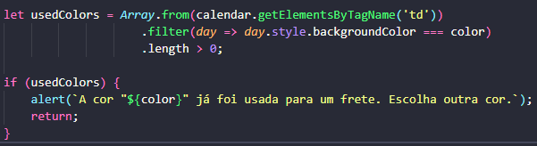
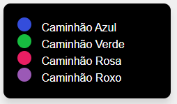
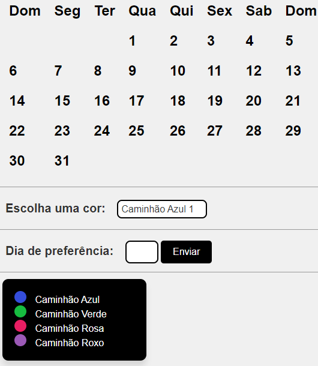

# Calendário Web 

# Introdução

 ## Neste seguinte projeto de calendário web foi dado contexto do problema e um caminho para solução;

## Contexto do Problema

 - A empresa Alpha está contratando estagiários para trabalhar na área de agendamento dos dos fretes contratos. Como você notou, trata-se de uma empresa de fretamento e a vaga é para ocupar uma área que ficará responsável por realizar os agendamentos. A regra de agendamento será a seguinte: 
 - Existem 4 veículos para realização do frete; 
 - Cada veículo será identificado por uma cor; 
 - Um veículo não pode fazer mais de um frete no mesmo dia; 

 ## Solução do Problema
 - Existem 4 veículos para realização do frete;
 - Cada um com sua respectiva cor sendo elas, Azul para o veículo 1, Verde para o veículo 2, Rosa para o veículo 3, Roxo para o veículo 4.
 -  
 - Também é preciso colocar uma legenda na aplicação que permite identificar a cor respectiva de cada veículo.
 
 ### É necessário montar um projeto que crie um calendário que, utilizando linguagem javascript, HTML5 e CSS3, permita a marcação de dias, atribuindo a eles a cor do veículo que fará o frente naquele dia.
 - A estrutura do código HTML do calendário foi fornecida pelo professor 
 - 

 ### Sendo assim abaixo será apresentadas todas as alterações feitas para que a solução do projeto esteja de acordo com código fornecido.
  ## 1. Alteração: A principal alteração feita foi uma função para colorir os dias respectivamente da seleção dos caminhões feita pelo usuário.
  - 
  ## 2. Alteração: Logo após a função de coloria o dia foi feita a função de conferir se o dia selecionado pelo usuário está de acordo com ds dias do calendário. 
  - 
  ## 3. Alteração: Verificação se cor selecionado pelo usuário não será usada no mesmo dia.
  - 
  ## 4. Alteração: Adição das legendas das cores respectivas dos caminhões.
  - 

## Projeto Final com as alterações e modificações realizadas.

 ### Neste presente trabalho com as modificações e alterações realizadas tanto no arquivo HTML, CSS e Javascript temos um calendário web que possibilita o usuário marcar um frete selecionando o dia conforme sua preferência e também selecionando o caminhão conforme a cor, sendo assim temos uma legenda que informas as cores dos respectivos caminhões.
 - 